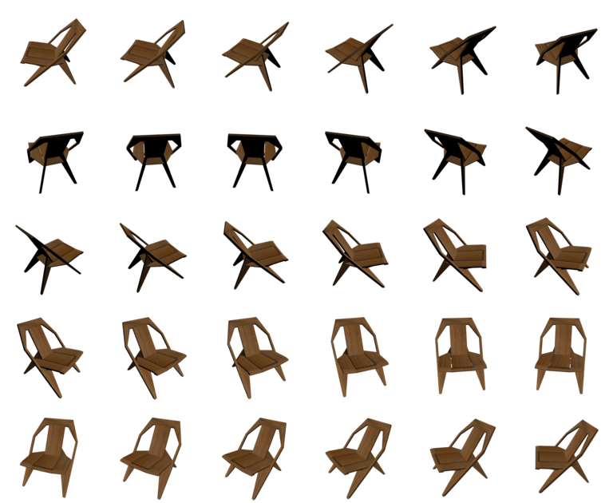
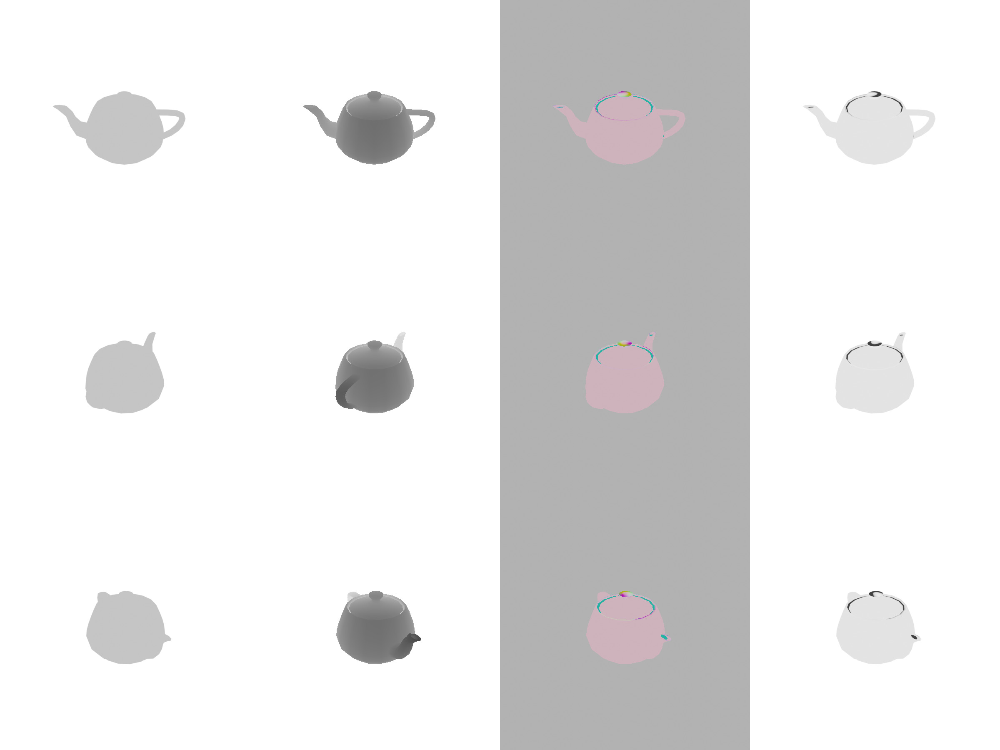

# Stanford Shapenet Renderer

A little helper script to render .obj files (such as from the stanford shapenet database) with Blender.

Tested on Linux, but should also work for other operating systems.
By default, this scripts generates 30 images by rotating the camera around the object.
Additionally, depth, albedo, normal and id maps are dumped for every image.

Tested with Blender 2.9

## Example invocation

To render a single `.obj` file, run

    blender --background --python render_blender.py -- --output_folder /tmp path_to_model.obj

To get raw values that are easiest for further use, use `--format OPEN_EXR`. If the .obj file references any materials defined in a `.mtl` file, it is assumed to be in the same folder with the same name.

## Batch rendering

To render a whole batch, you can e. g. use the unix tool find:

    find . -name *.obj -exec blender --background --python render_blender.py -- --output_folder /tmp {} \;

To speed up the process, you can also use xargs to have multiple blender instances run in parallel using the `-P` argument

    find . -name *.obj -print0 | xargs -0 -n1 -P3 -I {} blender --background --python render_blender.py -- --output_folder /tmp {}

## Example images

Here is one chair model rendered with 30 different views:

or a teapot with all available outputs

